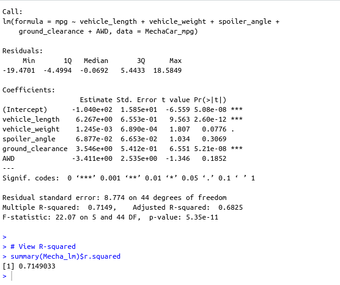
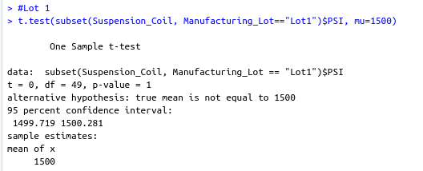
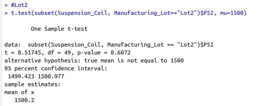
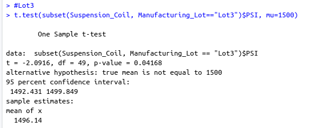

# MechaCar_Statistical_Analysis
Using Statistics and R to analyze a series of datasets.

## Background

### Overview

This project consists of three technical analysis deliverables and a proposal for further statistical study:

- Deliverable 1: Linear Regression to Predict MPG

- Deliverable 2: Summary Statistics on Suspension Coils

- Deliverable 3: T-Test on Suspension Coils

- Deliverable 4: Design a Study Comparing the MechaCar to the Competition

### Purpose

The client upper management has called on us and the data analytics team to review the production data for insights that may help the manufacturing team.

In this project, we helped the data analytics team do the following:

- Perform multiple linear regression analysis to identify which variables in the dataset predict the mpg of MechaCar prototypes.

- Collect summary statistics on the pounds per square inch (PSI) of the suspension coils from the manufacturing lots.

- Run t-tests to determine if the manufacturing lots are statistically different from the mean population.

-Design a statistical study to compare vehicle performance of the MechaCar vehicles against vehicles from other manufacturers. For each statistical analysis, you’ll write a summary interpretation of the findings.

  
## Resources

Data source:

- (1) MechaCar_mpg.csv, (2) Suspension_Coil.csv

Software:

- R version 4.2.1, RStudio 2022.07.2 Build 576, Visual Studio Code 1.71.2
 
 

## Results

### D1: Linear Regression to Predict MPG:

(a)
 
 Figure (a) MechaCar Linear Regression Summary

 

- Q1. Which variables/coefficients provided a non-random amount of variance to the mpg values in the dataset?

    - Methodology: Pr(>|t|) value represents the probability that each coefficient contributes a random amount of variance to the linear model.

    - A1. Using the MechaCar_mpg dataset, vehicle_lenght and ground_clearance (as well as intercept) are statistically unlikely to provide random amount of variance to the linear model. In other word **The vehicle_length and grond_clearance have a significant impact on mpg.**

- Q2. Is the slope of the linear model considered to be zero? Why or why not?

    - Methodology: Examine the Pr(>|t|) value in the summary above for the (Intercept).

    - A2. **The Intercept is statistically significant** (less than the 0.05) **and not zero**. This would indicate that the Intercept term explains a significant amount of variance in the dependant variable when all the independant variables are equal to zero. it could be that the significant feature (such as vehicle lenght and ground_clearance) may need scaling or transforming to help improve the prdictive power of the model; or there are other variables that can help explainthe variability of our dependant variable (mpg) that has not been included in our model.

- Q3. Does this linear model predict mpg of MechaCar prototypes effectively? Why or why not?

    - Methodology: Examine the multiple R-squared to indicate how well the regression model approximate to rea-world data points. In most caese, the value will range between o and 1 and can be use as probability metric to determine the likelihood that future data point will fit the model.

    - A3. **The Multiple R-squared value is 0.71**, while the p-value remained significant (very small). **Indicating that the model does an adequate job predicting mpg**.

 

### D2: Summary Statistics on Suspension Coils:

(b)
 
 Figure (b) Total Summary for Suspension Colis.

 

(c)
 
 Figure (c) View by lot using group_by

 

Q1.The design specifications for the MechaCar suspension coils dictate that the variance of the suspension coils must not exceed 100 pounds per square inch. Does the current manufacturing data meet this design specification for all manufacturing lots in total and each lot individually? Why or why not?

- Methodology:

- A1. **In Total the specifications are met with a variance of 62.29 (less than a 100)**.

- A2. **By lots, lots 1 and 2 meets specifications, however lot 3 has a variance that exceed specifications (100 psi)**.

 

### D3: T-Tests on Suspension Coils:

**Lot 1 is NOT significantly different from the population mean with a p-value of 1**.

(d)
 
 Figure (d) T-Test for Lot 1

 

**Lot 2 is NOT significantly different from the population mean with a p-value of 0.61**.

(e)
 
 Figure (e) T-Test for Lot 2

 

**Lot 3 is significantly different from the population mean with a p-value of 0.042**.

(f)
 
 Figure (f) T-Test for Lot 3

 

### D4: Study Design: MechaCar vs Competition

- Q1. What metric or metrics are you going to test?

- A1. An additional metric not in the MechaCar_mpg dataset are horsepower, engine size or number of cylinders. Manufacturers may look into thsi since is usually noted that smaller engine size (8 cyl vs 6 cyl vs 4 cyl) result in improved mpg.

- Q2. What is the null hypothesis or alternative hypothesis?

- A2. The Null hypothesis would be that there is NO statistical difference and the Alternative hypothesis would be there is a statistical difference.

    - H0 : The means of all groups are equal, or µ1 = µ2 = … = µn.
    - Ha : At least one of the means is different from all other groups.

- Q3. What statistical test would you use to test the hypothesis? And why?

- A3. Since a car manufacturer may have multiple competitiors we are going to use an **two way ANOVA test**; to determine if there a statistical difference between the distribution means from multiple samples.

- Q4. What data is needed to run the statistical test?

- A4. To perform an ANOVA test in R, we have to provide the aov()function two arguments:

    - formula - a formula specifiying the model.
    - data - a DataFrame in which the variable specified in the formula is found.

## Summary

- A1: Bikes are checkout (on average) 6-7 minutes.

- A2: Bikes trips vary by hour of the day with peak hours at 5-6 pm and 7 am.

- A3: Bikes trips are more popular during Thursdays and Fridays for all users regardless of gender. Customers had a higher rate of bike trips during the weekends compared to weekdays.

## References

[Markdown](https://docs.github.com/en/get-started/writing-on-github/getting-started-with-writing-and-formatting-on-github/basic-writing-and-formatting-syntax)

[R_Documentation](https://www.rdocumentation.org/)

